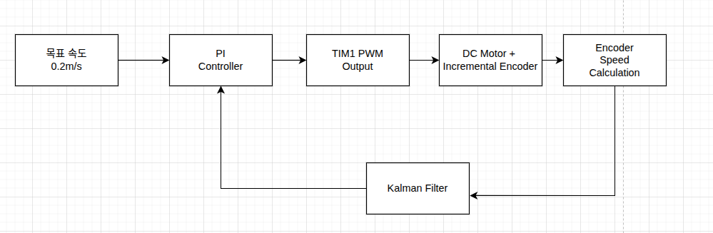
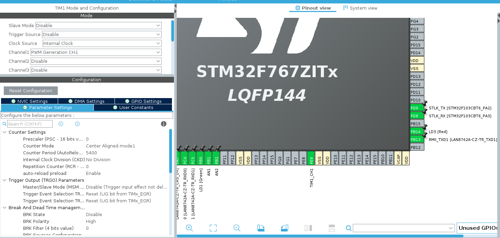
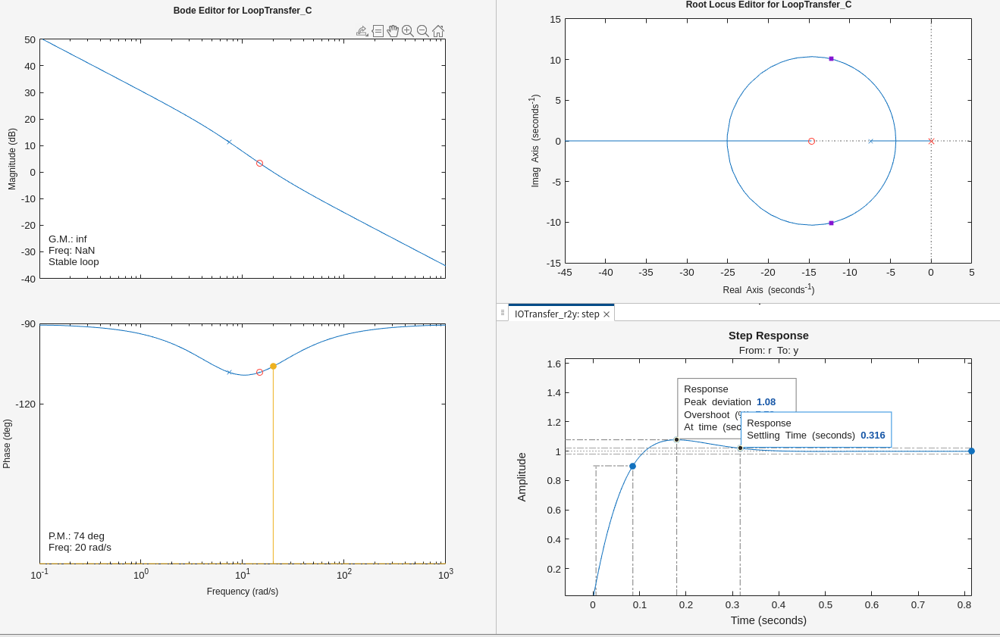
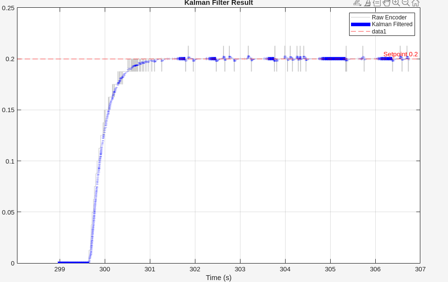
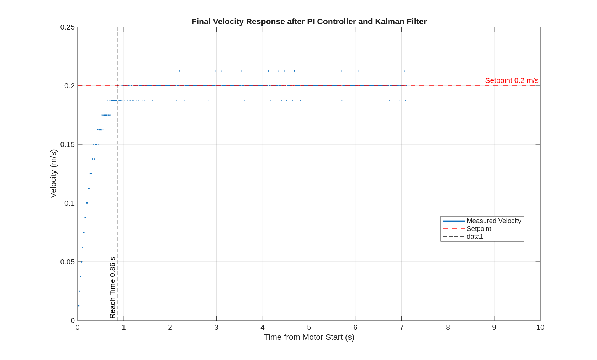

# DC Motor Precision Speed Control using PI Controller and Kalman Filter

## 프로젝트 소개

STM32F746NG를 이용하여 DC 기어모터의 정밀 속도 제어 시스템을 구현하였습니다.

엔코더를 이용하여 모터의 회전 속도를 측정하고, MATLAB System Identification Toolbox를 이용하여 실제 모터의 전달함수를 추정하였습니다.

추정된 전달함수를 기반으로 MATLAB Control System Designer(SISOTOOL)에서 PI Controller를 설계하였으며, Tustin(Bilinear) 변환을 통해 디지털 PI Controller를 구현하여 STM32에 적용하였습니다.

또한 엔코더의 양자화 오차와 측정 노이즈를 감소시키기 위해 1차 Kalman Filter를 적용하여 속도 추정값을 안정화하였습니다.

---

## 시스템 블록도

<p align="center">

</p>

---

## 프로젝트 목표

* 목표 속도 **0.2 m/s** 추종
* PI Controller를 이용한 속도 제어
* System Identification을 이용한 Plant 모델링
* Tustin(Bilinear) 기반 Digital PI 구현
* Kalman Filter를 이용한 속도 추정
* 실제 시스템 기반 제어 성능 검증

---

## 시스템 구성

| Item              | Specification                           |
| ----------------- | --------------------------------------- |
| MCU               | STM32F746NG                             |
| Motor             | JGA25-371 DC Geared Motor (1:34)        |
| Encoder           | 12 CPR (X4 Quadrature, 1632 Counts/Rev) |
| PWM               | TIM1 Center-Aligned PWM                 |
| Encoder Interface | TIM3 Encoder Mode                       |
| Control Period    | 10 ms                                   |

---

## STM32 Peripheral Configuration

TIM1을 이용하여 Center-Aligned PWM을 생성하였으며, TIM3 Encoder Interface를 이용하여 엔코더의 회전 속도를 실시간으로 계산하였습니다.

<p align="center">

</p>

---

# Controller Design

## 1. System Identification

일정한 PWM(CCR) Step 입력을 인가하여 모터의 속도 응답 데이터를 CSV 형태로 저장하였습니다.

수집한 입력(PWM)과 출력(속도) 데이터를 MATLAB System Identification Toolbox를 이용하여 분석하고, 모터를 1차 선형 전달함수로 모델링하였습니다.

### Estimated Plant Model

모터의 입력(PWM)과 출력(속도) 데이터를 기반으로 다음과 같은 1차 전달함수를 도출하였습니다.

```math
G(s)=\frac{0.00507}{0.135s+1}
```
추정된 전달함수를 기반으로 PI Controller를 설계하였습니다.

---

## 2. PI Controller Design

MATLAB Control System Designer(SISOTOOL)를 이용하여 PI Controller를 설계하였습니다.

설계한 연속시간 PI Controller를 Tustin(Bilinear) 변환을 이용하여 Digital PI Controller로 변환한 후 STM32에 구현하였습니다.

또한 Step Response와 Phase Margin을 기준으로 제어 성능을 분석하였으며, 실제 구동 결과를 기반으로 PI Gain을 추가적으로 Fine-Tuning하여 최종 제어기를 완성하였습니다.

<p align="center">

</p>

---

## 3. Kalman Filter

엔코더 속도는 Tick 기반 계산으로 인해 양자화 오차와 측정 노이즈가 발생합니다.

이를 보완하기 위해 1차 Kalman Filter를 적용하여 속도 추정값을 계산하였으며, Raw Encoder 속도와 Kalman Filter 적용 후 속도를 비교하여 노이즈 감소 효과를 확인하였습니다.

<p align="center">

</p>

---

# Experimental Result

PI Controller와 Kalman Filter를 적용한 결과 목표 평균 속도 **0.2 m/s**를 안정적으로 추종하였습니다.

<p align="center">

</p>

### Performance

| 항목                    | 결과                          |
| --------------------- | --------------------------- |
| 목표 속도                 | **0.200 m/s**               |
| 평균 정상상태 속도            | **0.19994 m/s**             |
| 평균 정상상태 오차            | **약 0.03 %**                |
| 정착 시간 (Settling Time) | **약 0.86 s**                |
| 최대 속도                 | **약 0.2126 m/s**            |
| 최대 오버슈트               | **약 6.3 %**                 |
| 제어 주기                 | **10 ms**                   |
| 속도 추정                 | **1st Order Kalman Filter** |

---

## 구현 내용

* TIM1 Center-Aligned PWM 생성
* TIM3 Encoder Interface
* 엔코더 기반 실시간 속도 계산
* MATLAB System Identification
* PI Controller 설계
* Tustin(Bilinear) 기반 Digital PI 구현
* Digital PI Difference Equation 구현
* 1차 Kalman Filter 구현
* UART 기반 CSV Logging
* MATLAB 기반 제어 성능 분석

---

## 사용 기술

* STM32 HAL
* FreeRTOS
* Timer (PWM)
* Encoder Interface
* PI Control
* Kalman Filter
* MATLAB
* System Identification Toolbox
* Control System Designer (SISOTOOL)
* Tustin (Bilinear Transform)
* CSV Data Analysis

---

## Project Highlights

* 실제 모터의 속도 응답 데이터를 이용하여 System Identification 수행
* MATLAB Control System Designer를 이용한 PI Controller 설계
* Tustin(Bilinear) 변환을 통한 Digital PI Controller 구현
* Kalman Filter를 이용한 엔코더 속도 노이즈 감소
* STM32F746NG 기반 실시간 폐루프 속도 제어 시스템 구현
* 실제 실험을 통한 제어 성능 검증 및 Fine-Tuning 수행

---

## Technical Report

프로젝트의 설계 과정과 실험 결과는 아래 보고서에 정리되어 있습니다.

* PWM 및 Timer 설정
* 엔코더 속도 계산
* MATLAB System Identification
* PI Controller 설계
* Digital PI(Tustin) 구현
* Kalman Filter 구현
* 실험 결과 및 제어 성능 분석

📁 **docs/Report.pdf**

